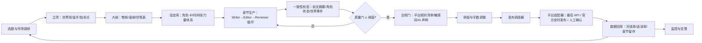

# 全自动小说生成与发布工作流 · 规划文档

> 规划日期：2026-08-09　|　状态：待平台与预算决策后启动 Phase 0

---

## 1. 项目目标与完成标准

**一句话目标**：输入一个选题方向，系统自动完成「市场调研 → 立项 → 大纲 → 章节生成 → 质量校验 → 合规校验 → 定时发布 → 数据回采 → 反馈调优」的闭环，让小说按计划在指定平台持续更新。

**完成标准（Definition of Done）**：

- 章节质量门通过率 ≥ 95%（情节、文笔、一致性、AI 痕迹、标点五维评分）
- 平台审核通过率 100%，零违规处罚（标注、红线内容、低质治理全部规避）
- 连续 7 天无人值守定时发布成功，断更率 0
- 账号安全：试点阶段 0 封号、0 限流处罚
- 成本受控：单章（约 2000-2300 字）token 成本在预算上限内，超出自动告警
- 数据闭环：完读率 / 追读率有基线记录，并能反向影响下一卷大纲

---

## 2. 平台合规调研结论（截至 2026-08）

这是整个项目的**第一道质量门**。各平台对 AI 生成内容的态度差异极大，先选平台再定技术路线。

| 平台 | 自动化可行性 | AI 内容政策要点 |
|---|---|---|
| 番茄小说 | 高 | 已有非官方 HTTP 接口（Cookie + CSRF）和开源 MCP 工具（tomato-writer-mcp），支持发布 / 定时发布；Playwright 可兜底。2025-09-01 起《人工智能生成合成内容标识办法》施行，作者必须主动声明 AI 生成内容；平台严禁滥用 AI 批量生成低质内容（2025 年 4-5 月公告），并有「AI 痕迹检测 + 人工抽检」双机制。 |
| 晋江文学城 | 低（不建议全自动） | 2025-02-17《关于 AI 辅助写作使用、判定的试行公告》：仅允许文字校对、创意要素、粗纲三类 AI 辅助；正文全 AI 生成属违规，处罚为锁章、黄牌一个月、永久禁榜，V 文需退还订阅。 |
| 起点 / 阅文 | 中 | 官方「作家助手」App 原生支持**定时发布**，走官方渠道最稳；无公开发布 API，自动化需依赖官方客户端或网页端操作。阅文自有「妙笔」AI 工具，需按平台条款使用并关注 AI 标注要求。 |
| 七猫 / 纵横 | 中 | 已较早要求作者对生成式 AI 使用情况进行标注。 |
| 海外（Royal Road / Webnovel / Wattpad） | 高 | AI 政策相对宽松，且平台多支持 API 或公开发布接口；若内容以中文为主则流量逻辑不同。 |

**结论**：

- 若目标是「全自动生成正文并发布」，**首选番茄小说**：工具链最成熟（有现成 MCP 与开源项目），配合 AI 声明与质量门可合规运行。
- 晋江只适合「人主导、AI 辅助到粗纲」的半自动模式，全自动方案不要碰。
- 起点适合走官方客户端定时发布，自动化只做「写稿 + 排版 + 提醒」，发布动作保留在官方渠道。

---

## 3. 总体架构

核心思想：**生成是流水线，质量是关卡**。每一章不是「写出来就发」，而是必须过完「生成 → 润色 → 审稿 → 一致性 → 合规」五关才允许进入发布队列。

---

## 4. 模块设计

### 4.1 选题与市场调研

- 采集目标平台的榜单、热门题材、读者评论，产出「选题卡片」：题材、受众、核心卖点、参考书、竞争强度、预计字数。
- 输入一个方向即可生成 3 个候选选题，人工或规则挑选 1 个。

### 4.2 立项与大纲

- 立项产出：书名（候选 5 个）、简介、世界观、金手指、目标读者、更新频率、目标字数。
- 大纲分层：卷纲（每卷 3-5 句目标与转折）→ 章纲（每章 1-2 句，含钩子与爽点）→ 伏笔表（埋设章节 / 回收章节，防断线）。

### 4.3 设定与记忆（长篇一致性的命根子）

- 结构化存储：SQLite 保存角色卡、势力、物品、时间线、力量体系、已发生事件。
- 向量记忆：ChromaDB（或 MemMachine）保存每章摘要、角色状态、世界事件，写新章前检索前文。
- 每章完成后由记忆 Agent 更新角色状态与事件表；每 5 章做一次全局一致性审查。

### 4.4 章节生产（多智能体循环）

- WriterAgent：按章纲 + 检索到的上下文写初稿。
- EditorAgent：润色、调字数（目标 2000-2300 字）、去 AI 味。
- ReviewerAgent：五维评分（字数 / 情节完成度 / 文笔 / AI 痕迹 / 标点与衔接），≥ 7/10 才通过；未通过最多重写 3 次，仍不达标则标记人工介入。

### 4.5 质量门清单

- 字数在目标区间
- 紧扣章纲，有钩子、有推进
- 句式变化、对话自然、无「突然 / 眼神一凝」类程式化表达
- AI 痕迹检测自测（可用检测工具 + 人工抽检）
- 中文全角标点、对话引号规范
- 与前章剧情衔接无矛盾

### 4.6 合规门

- 平台规则 checklist（随平台配置加载）
- 敏感词与内容红线扫描（政治、色情、暴力等平台黑名单）
- AI 声明状态记录（发布时按平台要求勾选「含 AI 生成内容」）
- 输出合规报告，留档备查

### 4.7 发布模块（适配器模式）

- **番茄小说**：优先 tomato-writer-mcp（Cookie + X-Secsdk-Csrf-Token，直接调作者后台 HTTP 接口，支持定时发布，服务端到点自动发出）；失效自动提示重新抓取（Cookie 约 1-2 个月）；Playwright 作为兜底通道。
- **起点**：生成符合格式的章节稿件 + 发布提醒，由官方「作家助手」定时发布；或走网页后台 + 浏览器自动化（风险高，慎用）。
- **晋江**：仅人工确认发布，系统只做草稿和检查。

### 4.8 监控与告警

- 发布失败、审核驳回、章节被锁、账号异常、Cookie 失效
- 断更预警（存稿池低于安全线时告警）
- 成本告警（月度 token 用量超预算）
- 通知渠道：企业微信 / Telegram / 邮件，任选

### 4.9 数据反馈闭环

- 定期回采平台阅读数据（番茄 MCP 已支持书级概览与各章读完率 / 追读率）
- 完读率低的章节 → 反推大纲节奏问题；题材整体低迷 → 切换选题方向

---

## 5. 技术选型建议

| 层 | 推荐方案 | 备选 |
|---|---|---|
| 流程编排 | n8n（可视化，非程序员友好） | LangGraph（OpenNovel 同款，可控性强） |
| 基底项目 | fork OpenNovel（多智能体 + 记忆 + 番茄发布，MIT 协议） | 从零搭 |
| 写作模型 | 当前最强模型（Claude Opus 级 / 对应旗舰） | 按成本换 DeepSeek 等 |
| 编辑 / 审稿模型 | 中档模型（Sonnet 级） | — |
| 记忆模型 | 轻量模型（Haiku 级） | — |
| 存储 | SQLite + ChromaDB | MemMachine |
| 发布 | tomato-writer-mcp | Playwright 兜底 |
| 调度 | 优先平台侧定时发布；本地 APScheduler / n8n 定时 | cron |

**成本控制原则**：贵模型只做写作，便宜模型做审稿与记忆；单章字数设上限；预算告警。

---

## 6. 分阶段路线图

### Phase 0：合规与平台确认（2-3 天）

- 选定目标平台，通读作者协议与 AI 内容政策
- 注册小号（不用主号试错），确认签约 / 收益路径
- 产出《平台规则清单》
- **验收**：清单文档 + 小号可正常发文

### Phase 1：半自动 MVP（1-2 周）

- 搭好「选题 → 大纲 → 章节生成 → 质量门」链路
- 人工审核后手动发布（或平台定时发布）
- 目标：连续 10-20 章稳定过审，记录读者数据基线
- **验收**：质量门通过率 ≥ 95%，过审率 100%，单章人工耗时 < 15 分钟

### Phase 2：自动发布（约 1 周）

- 接入发布适配器 + 定时任务
- 建立存稿池（提前 3-5 章）与看门狗
- **验收**：连续 7 天无人值守发布成功，0 审核失败，断更率 0

### Phase 3：质量闭环（2-4 周）

- 数据回采 → 大纲 / 题材反馈调优
- 记忆系统打磨（一致性、伏笔回收）
- AI 痕迹专项治理 + 人工抽检制度化
- **验收**：完读率 / 追读率相对基线提升

### Phase 4：规模化（持续）

- 多书并行、多平台适配（先调研海外平台政策）
- 成本优化与备份、账号风险分散

---

## 7. 风险与对策

| 风险 | 对策 |
|---|---|
| 封号 / 限流 | 先小号；如实标注 AI 内容；控制批量速度；不碰水化 / 堆砌类低质操作 |
| AI 痕迹过重 | 反模板化提示词 + 检测工具自测 + 人工抽检 |
| 长篇一致性崩塌 | 大纲先行 + 设定库 + 每 5 章全局审查 |
| 成本失控 | 模型分级 + 字数上限 + 预算告警 |
| 断更 | 存稿池 + 健康检查 + 通知 |
| 平台接口变动 | 适配器封装 + Playwright 兜底 + Cookie 刷新流程 |

---

## 8. 待定决策（需要拍板）

1. **目标平台**：番茄小说（推荐，工具链最成熟）/ 起点 / 晋江 / 海外
2. **目的**：练手 / 流量试验 / 收益
3. **每月 API 预算**：决定模型档位与产量
4. **技术路线**：n8n 可视化编排 vs fork OpenNovel vs 从零写
5. **账号策略**：小号试错（推荐）还是直接用主号
6. **单章字数与更新频率**：默认 2000-2300 字 / 日更 2 章，可调

---

## 9. 下一步

拍板「平台 + 预算 + 技术路线」三项后，即可启动 Phase 0：先出《平台规则清单》，再用小号验证一条最小链路（1 个选题 → 3 章 → 手动发布 → 观察审核与数据）。
