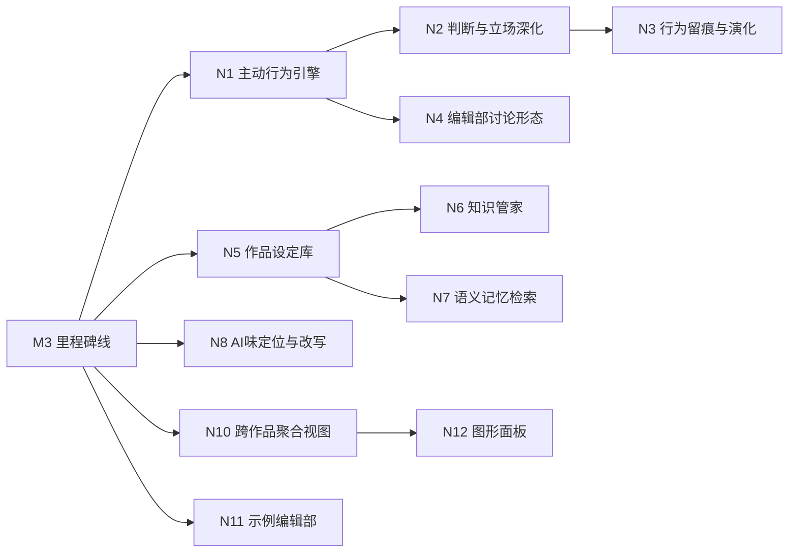

# 06 新能力清单（Next Capability Backlog）

## 定位

本清单是 M4 三个工程瓶颈（CLI 拆包 / 检索性能 / 测试分片）收口后的新阶段立项入口：把后续要做的新能力按需求定义四层（价值 → 目标 → 功能 → 可执行单元）逐项落地。每个能力独立走完整开发流程：立项（实施文档）→ 派包实现 → 验收 → 独立审查 → 收口归档。

## 候选来源与取舍原则

- 只收编能回溯到 G1–G5 的候选；挂不上的砍。
- 前身与旧 playbook（n8n 流水线 / 工作日节拍 / 强制晨会）是反面教材：强制关卡、流程机器不做；"开会是方式不是核心"；自然协作是魂。
- 旧领域案例（AI 编辑部 playbook）中可借鉴的**行为机制**（行为选择权、记忆演化、发言留痕）重新定义为"自然行为"能力，不复用其流水线形态。
- 用户已明确不做：自动发布到外部平台、成本核算中心、多作者实时共编、一键从想法到完结的全自动流水线、强制流程关卡。

## 能力清单（按建议实施顺序）

### M5 自然行为与自由意志（主线，G1 / G3）

| 编号 | 功能 | 用户故事 | 优先级 | 所属目标 | 依赖 |
| --- | --- | --- | --- | --- | --- |
| N1 | 主动行为引擎 | 作为作者，我想让伙伴在自然触发点自主发起协作（写手主动追问设定、责编主动退稿、审稿主动提示矛盾、主编主动召集方向讨论），以便编辑部像真人一样运转，不需要我逐条驱动 | P0 | G1 | M3 全部 |
| N2 | 判断与立场深化 | 作为作者，我想让伙伴在协作中真正行使判断权（接受/拒绝/反驳任务、坚持立场、分歧可被记录），以便他们是完整的人而不是执行器 | P0 | G3 | N1 |
| N3 | 行为留痕与演化 | 作为作者，我想让伙伴的行为沉淀为印象、关系与情绪变化，观点变化形成演化时间线，以便他们越协作越有来历 | P0 | G3 / G4 | N2 |
| N4 | 编辑部讨论形态 | 作为作者，我想让伙伴就关键方向/大纲发起一轮有结构的多方讨论（点将、通气、总结、落盘），以便大决策前有真实碰撞 | P1 | G1 | N1 / N2 |

### M6 知识库重构（G4）

| 编号 | 功能 | 用户故事 | 优先级 | 所属目标 | 依赖 |
| --- | --- | --- | --- | --- | --- |
| N5 | 作品设定库 | 作为作者，我想让设定（人物、关系、时间线、世界观）条目化、版本化、来源可溯，以便后续创作引用时知道它从哪来、改过什么 | P0 | G4 | M3 全部 |
| N6 | 知识管家 | 作为作者，我想让设定变更自动分发到相关层并在后续创作中生效，陈旧/矛盾设定被识别，以便向下分发闭环不靠人肉 | P0 | G4 | N5 |
| N7 | 语义记忆检索 | 作为作者，我想按"意思相近"而非仅关键词命中来联想相关记忆片段，以便检索真正服务创作（向量检索；已评估为架构级增量，独立立项） | P1 | G4 | N5 / 检索层 |

### M7 质量深化（G2）

| 编号 | 功能 | 用户故事 | 优先级 | 所属目标 | 依赖 |
| --- | --- | --- | --- | --- | --- |
| N8 | AI 味定位与改写建议（F16） | 作为作者，我想知道 AI 味具体在哪些位置、怎么改，以便快速返工而不是猜 | P1 | G2 | F15 |
| N9 | 质量门语料校准 | 作为作者，我想让质量门阈值随真实语料校准，以便"无 AI 味"不是拍脑袋 | P1 | G2 | F15 / 真实语料 |

### M8 老板视角与开源（G1 / G4 / G5）

| 编号 | 功能 | 用户故事 | 优先级 | 所属目标 | 依赖 |
| --- | --- | --- | --- | --- | --- |
| N10 | 跨作品聚合视图 | 作为老板，我想一眼看到所有编辑部的状态（待拍板、卡点、产出），以便同时管理多部作品 | P1 | G1 / G4 | M3 全部 |
| N11 | 示例编辑部与剧本 | 作为新作者，我想开箱就有一个示例编辑部与示例作品可体验，以便 30 分钟感受到价值 | P2 | G5 | M3 全部 |
| N12 | 图形面板三扇窗（U27） | 作为作者，我想在图形面板里实时看见编辑部工作（事件流/穿透/提醒），以便更直观地掌握动静 | P2 | G1 | N10 / CLI 机制先行 |

## 明确不做（本清单边界）

- 自动发布到外部平台（番茄/起点等）。
- 成本核算中心 / 预算仪表盘。
- 多作者实时共编。
- 一键从想法到完结的全自动流水线。
- 强制流程关卡、工作日节拍、固定晨会（旧 playbook 形态，与自然协作冲突）。
- 多语言文档、桌面安装器（开源层细节，随 N11/N12 需要再议）。

## 依赖与里程碑

- M5（自然行为）：N1 → N2 → N3，N4 视 N1/N2 落地情况排入或延后。
- M6（知识库）：N5 → N6，N7 独立立项（风险前置：嵌入依赖与增量一致性）。
- M7（质量）：N8 → N9。
- M8（视角与开源）：N10 → N12；N11 可随时并行。
- 每项能力内部再拆可执行单元（实施文档），逐单元验收。

## 反盲从三问（本清单）

1. 这是需求还是方案？清单是需求（能力与目标对应）；具体机制（如何触发主动行为、设定库表结构、向量检索方案）是方案，在各自实施文档中定义。
2. 依据是什么？N1–N3 直接对应 G1/G3 成功标准（"角色能自主发起协作""有立场、有记忆"）；N5–N7 对应 G4 信息分层（沉淀/分发/按需取用）；N8–N9 对应 G2 硬指标；N10–N12 对应老板穿透与开源价值。均有可验收的成功标准。
3. 不做会怎样？不做 N1–N3，编辑部仍是"作者逐条驱动"的伪自然；不做 N5–N7，信息分层停在手工检索；不做 N8，无 AI 味不可迭代校准。

## 决策记录

- 2026-08-14：用户确认三个工程瓶颈收口后，先拉新能力清单，再依次按开发 skill 全流程完成。
- 否决：旧 playbook 的工作日状态机/固定晨会/发布链路（与当前价值主张冲突，N4 仅保留"讨论形态"作为自然协作的一种方式）。
- 风险：N7 向量检索是架构级增量（嵌入依赖、增量一致性、行为契约变化），独立立项、风险前置；N4 若变成强制会议流程则回退（自然优先）。

## 验收门

- 每个能力可回溯到 G1–G5，无孤儿功能。
- 不做清单明确。
- 依赖可排、无循环。
- 用户以决策者身份确认清单与实施顺序后，从 N1 开始逐项立项。
