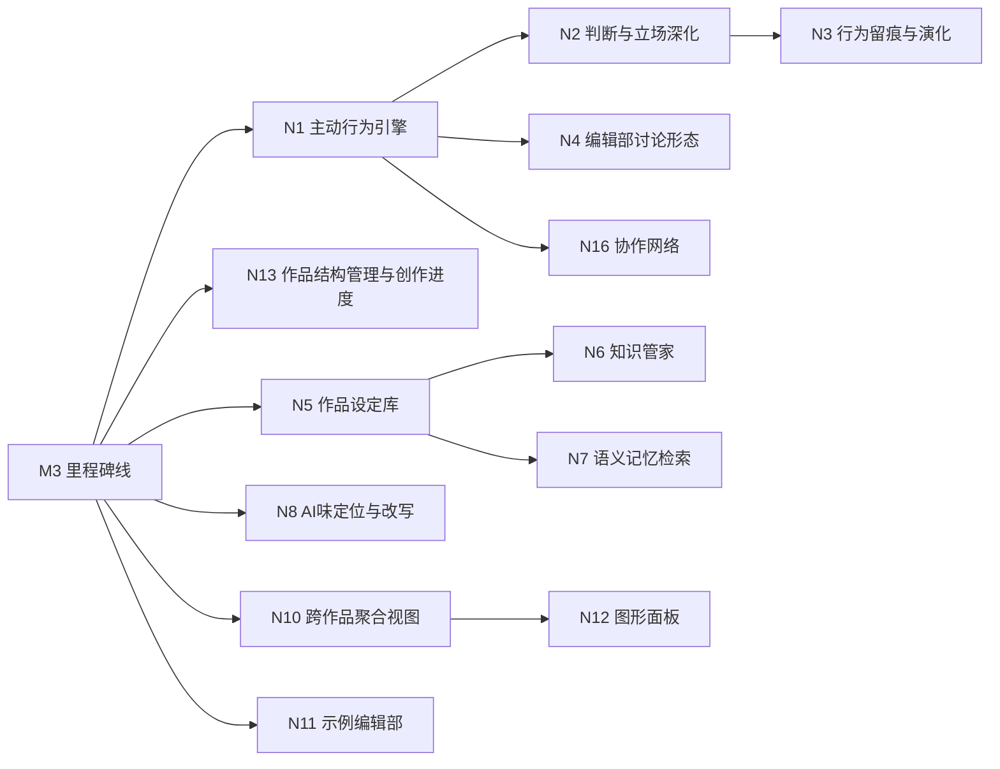

# 06 新能力清单（Next Capability Backlog）

## 定位

本清单是 M4 三个工程瓶颈（CLI 拆包 / 检索性能 / 测试分片）收口后的新阶段立项入口：把后续要做的新能力按需求定义四层（价值 → 目标 → 功能 → 可执行单元）逐项落地。每个能力独立走完整开发流程：立项（实施文档）→ 派包实现 → 验收 → 独立审查 → 收口归档。

## 候选来源与取舍原则

- 只收编能回溯到 G1–G5 的候选；挂不上的砍。
- 前身与旧 playbook（n8n 流水线 / 工作日节拍 / 强制晨会）是反面教材：强制关卡、流程机器不做；"开会是方式不是核心"；自然协作是魂。
- 旧领域案例（AI 编辑部 playbook）中可借鉴的**行为机制**（行为选择权、记忆演化、发言留痕）重新定义为"自然行为"能力，不复用其流水线形态。
- 用户已明确不做：自动发布到外部平台、成本核算中心、多作者实时共编、一键从想法到完结的全自动流水线、强制流程关卡。

## 能力清单（按建议实施顺序）

### M5 自然行为与自由意志（主线，G1 / G3）

| 编号 | 功能 | 用户故事 | 优先级 | 所属目标 | 依赖 |
| --- | --- | --- | --- | --- | --- |
| N1 | 主动行为引擎 | 作为作者，我想让伙伴在自然触发点自主发起协作（写手主动追问设定、责编主动退稿、审稿主动提示矛盾、主编主动召集方向讨论），以便编辑部像真人一样运转，不需要我逐条驱动 | P0 | G1 | M3 全部 |
| N2 | 判断与立场深化 | 作为作者，我想让伙伴在协作中真正行使判断权（接受/拒绝/反驳任务、坚持立场、分歧可被记录），以便他们是完整的人而不是执行器 | P0 | G3 | N1 |
| N3 | 行为留痕与演化 | 作为作者，我想让伙伴的行为沉淀为印象、关系与情绪变化，观点变化形成演化时间线，以便他们越协作越有来历 | P0 | G3 / G4 | N2 |
| N4 | 编辑部讨论形态 | 作为作者，我想让伙伴就关键方向/大纲发起一轮有结构的多方讨论（点将、通气、总结、落盘），以便大决策前有真实碰撞 | P1 | G1 | N1 / N2 |

### M6 知识库重构（G4）

| 编号 | 功能 | 用户故事 | 优先级 | 所属目标 | 依赖 |
| --- | --- | --- | --- | --- | --- |
| N5 | 作品设定库 | 作为作者，我想让设定（人物、关系、时间线、世界观）条目化、版本化、来源可溯，以便后续创作引用时知道它从哪来、改过什么 | P0 | G4 | M3 全部 |
| N6 | 知识管家 | 作为作者，我想让设定变更自动分发到相关层并在后续创作中生效，陈旧/矛盾设定被识别，以便向下分发闭环不靠人肉 | P0 | G4 | N5 |
| N7 | 语义记忆检索 | 作为作者，我想按"意思相近"而非仅关键词命中来联想相关记忆片段，以便检索真正服务创作（向量检索；已评估为架构级增量，独立立项） | P1 | G4 | N5 / 检索层 |

### M7 质量深化（G2）

| 编号 | 功能 | 用户故事 | 优先级 | 所属目标 | 依赖 |
| --- | --- | --- | --- | --- | --- |
| N8 | AI 味定位与改写建议（F16） | 作为作者，我想知道 AI 味具体在哪些位置、怎么改，以便快速返工而不是猜 | P1 | G2 | F15 |
| N9 | 质量门语料校准 | 作为作者，我想让质量门阈值随真实语料校准，以便"无 AI 味"不是拍脑袋 | P1 | G2 | F15 / 真实语料 |

### M8 老板视角与开源（G1 / G4 / G5）

| 编号 | 功能 | 用户故事 | 优先级 | 所属目标 | 依赖 |
| --- | --- | --- | --- | --- | --- |
| N10 | 跨作品聚合视图 | 作为老板，我想一眼看到所有编辑部的状态（待拍板、卡点、产出），以便同时管理多部作品 | P1 | G1 / G4 | M3 全部 |
| N11 | 示例编辑部与剧本 | 作为新作者，我想开箱就有一个示例编辑部与示例作品可体验，以便 30 分钟感受到价值 | P2 | G5 | M3 全部 |
| N12 | 图形面板三扇窗（U27） | 作为作者，我想在图形面板里实时看见编辑部工作（事件流/穿透/提醒），以便更直观地掌握动静 | P2 | G1 | N10 / CLI 机制先行 |

## 明确不做（本清单边界）

- 自动发布到外部平台（番茄/起点等）。
- 成本核算中心 / 预算仪表盘。
- 多作者实时共编。
- 一键从想法到完结的全自动流水线。
- 强制流程关卡、工作日节拍、固定晨会（旧 playbook 形态，与自然协作冲突）。
- 多语言文档、桌面安装器（开源层细节，随 N11/N12 需要再议）。

## 候选扩展（第一轮脑暴，待用户取舍后正式并入）

在 N1–N12 之外，按"创作与协作本身是核心"补一轮候选。每条标注建议优先级与依据；取舍权在用户，砍掉的理由也会记录。

### 创作形态与作品结构

| 编号 | 功能 | 用户故事 | 建议优先级 | 所属目标 | 依赖 |
| --- | --- | --- | --- | --- | --- |
| N13 | 作品结构管理与创作进度 | 作为作者，我想把作品组织成可选的层级结构（卷/章/篇目），大纲作为可选的创作计划版本演进，创作进度（创作中/已完成/搁置）可跟踪，以便短篇、长篇、诗集、同人等各类作品都有一套通用的骨架 | P0 | G1 / G4 | M3 全部 |
| N14 | 多写手并行班子 | 作为作者，我想在一部作品里配置多位写手分章并行创作，以便大长篇不用等单写手串行写 | P1 | G1 | N13 |
| N15 | 灵感素材库 | 作为作者，我想把灵感、素材、意象、片段随手存进作品库，创作时按需取用，以便灵感不丢、写作不干 | P2 | G4 | N5 |

### 协作网络与记忆人性化

| 编号 | 功能 | 用户故事 | 建议优先级 | 所属目标 | 依赖 |
| --- | --- | --- | --- | --- | --- |
| N16 | 协作网络（伙伴互委） | 作为作者，我想让伙伴之间也能互相委托与回应（写手请审稿看逻辑、责编请写手改、主编分派），以便协作网络不只围着作者转 | P0 | G1 / G3 | N1 / N2 |
| N17 | 记忆衰减与归档 | 作为作者，我想让伙伴的私有记忆随时间自然衰减、旧记忆归档，以便记忆像人一样有轻重，而不是无限堆叠 | P1 | G3 / G4 | N3 |
| N18 | 设定影响分析 | 作为作者，我想在改动设定后看到受影响的章节、伏笔与对话，以便知道这一改会牵动哪里 | P1 | G4 | N5 / N6 |
| N19 | 一致性自动核查 | 作为作者，我想让审稿自动对照设定库检查正文矛盾（人名、时间线、伏笔），以便长文一致性能守住 | P1 | G2 / G4 | N5 |

### 无 AI 味深化

| 编号 | 功能 | 用户故事 | 建议优先级 | 所属目标 | 依赖 |
| --- | --- | --- | --- | --- | --- |
| N20 | 文风参考学习 | 作为作者，我想提供几段自己喜欢的文本，让风格锚点从参考语料中提取特征，以便风格描述不再靠抽象词 | P1 | G2 / G4 | F14 |
| N21 | 风格漂移检测 | 作为作者，我想看到长文跨章节的风格一致性趋势，以便后半本不悄悄变味 | P1 | G2 | N8 |
| N22 | 好句识别与保留 | 作为作者，我想让质量门不只抓 AI 味坏词，也能认出出彩的句子并保留，以便去 AI 味不是一刀切 | P1 | G2 | F15 |
| N23 | 试读反馈回流 | 作为作者，我想导入试读者的批注与评分，让它进入质量校准，以便"无 AI 味"有外部真实反馈 | P2 | G2 / G5 | N9 |

### 产品形态与开源

| 编号 | 功能 | 用户故事 | 建议优先级 | 所属目标 | 依赖 |
| --- | --- | --- | --- | --- | --- |
| N24 | API 服务层 | 作为开发者/面板，我想通过 HTTP API 使用编辑部能力（CLI 同源），以便面板与外部工具不重复造轮子 | P1 | G1 | M3 全部 |
| N25 | 导入导出与备份 | 作为作者，我想把整部作品与编辑部设置导出/导入，以便换设备、迁移、备份都不丢 | P1 | G5 | M3 全部 |
| N26 | 预设编辑部模板 | 作为新作者，我想按题材（网文/同人/正统）一键生成预设班子与规则，以便开箱就能按体裁写作 | P2 | G5 | N11 |

### 建议先砍或延后的脑暴项（记录理由）

- 作者以角色身份参与对话（角色扮演辅助）：有趣但偏离"老板"定位，延后到核心稳定后再议。
- 本地数据加密：个人本地工具信任文件系统，等出现多人/共享场景再议。
- 事件订阅/Webhook 集成：没有明确消费方，砍。
- 插件/扩展点（自定义质量规则）：有价值但属于平台化，等 N24 API 落地后看需求再议。

## 依赖与里程碑

- M5（自然行为）：N1 → N2 → N3，N4 视 N1/N2 落地情况排入或延后。
- M6（知识库）：N5 → N6，N7 独立立项（风险前置：嵌入依赖与增量一致性）。
- M7（质量）：N8 → N9。
- M8（视角与开源）：N10 → N12；N11 可随时并行。
- 扩展候选并入原则：N13 与 N16 建议升为核心主线（长篇结构 / 协作网络，均 P0 或紧随 P0）；N14/N17–N22 按依赖挂到对应里程碑；N23–N26 排入视角与开源段。
- 每项能力内部再拆可执行单元（实施文档），逐单元验收。

## 反盲从三问（本清单含扩展候选）

1. 这是需求还是方案？清单是需求（能力与目标对应）；具体机制（如何触发主动行为、设定库表结构、向量检索方案）是方案，在各自实施文档中定义。
2. 依据是什么？N1–N3 / N16 对应 G1/G3 成功标准（"角色能自主发起协作""有立场、有记忆""伙伴互委"让协作网络不只围作者转）；N5–N7 / N13 / N15 / N17–N19 对应 G4 信息分层与长篇结构；N8–N9 / N20–N23 对应 G2 硬指标与迭代校准；N10–N12 / N24–N26 对应老板穿透与开源价值。
3. 不做会怎样？不做 N1–N3 / N16，编辑部仍是"作者逐条驱动"的伪自然；不做 N13，各类作品没有通用的结构骨架与进度跟踪；不做 N5–N7 / N18–N19，信息分层停在手工检索、一致性靠人肉；不做 N8 / N20–N22，无 AI 味不可迭代校准；不做 N24，面板会重复造轮子。

## 决策记录

- 2026-08-14：用户确认三个工程瓶颈收口后，先拉新能力清单，再依次按开发 skill 全流程完成。
- 2026-08-14：全清单核心与通用性审查（用户发起）。结论：无需要砍的功能；N13 从"大纲与连载管理"更名为"作品结构管理与创作进度"消除网文特化语义；六条通用性/核心红线（见下节）作为每项立项实施文档的强制继承项。
- 否决：旧 playbook 的工作日状态机/固定晨会/发布链路（与当前价值主张冲突，N4 仅保留"讨论形态"作为自然协作的一种方式）。
- 风险：N7 向量检索是架构级增量（嵌入依赖、增量一致性、行为契约变化），独立立项、风险前置；N4 若变成强制会议流程则回退（自然优先）。

## 通用性与核心红线（全清单强制继承）

以下红线在每一项立项实施文档中必须显式出现，作为验收边界；违反即回退。

1. **不设强制关卡（N1 / N4 / N16 主线）**：主动行为、讨论、互委全部是可选的自然协作形态；触发是概率/情境性的，伙伴与作者均可拒绝；不得出现"必须开会才能写""必须分配才能写""必须经过审批"之类的强制节点。
2. **沉淀不是前置（N5 / N6）**：设定库与知识分发随创作自然沉淀，不要求"先建设定/先过知识管家才能创作"；分发遵守信息分层裁剪，不向写手全量灌入（守 G4"最小充分信息"）。
3. **不工单化（N14 / N16）**：多写手并行与伙伴互委保持对话委托形态；不引入任务队列、认领状态机、超时惩罚等调度器语义（旧 playbook 教训）。摩擦与关系变化只由行为留痕（N3）自然产生。
4. **只报告不代笔（N19）**：一致性自动核查输出报告供审稿/作者判断，不自动改写正文、不绕过角色判断直接退稿。
5. **体裁自适应（N13 / N21）**：结构层级全部可选（零章节合法、无大纲合法）；风格漂移检测在短篇/单章/无章节作品上不报错、输出空态或跳过，不因缺少长篇结构而破坏通用创作路径。
6. **模板开放（N26）**：预设编辑部模板是起点不是封闭列表；题材、角色、规则均可自定义，模板数量不构成系统能力边界。

任何新能力若在实施中发现与以上红线冲突（例如需要强制节点才能跑通），停下回到本清单重新定义，不硬做。

## 验收门

- 每个能力可回溯到 G1–G5，无孤儿功能。
- 不做清单明确。
- 依赖可排、无循环。
- 用户以决策者身份确认清单与实施顺序后，从 N1 开始逐项立项。
